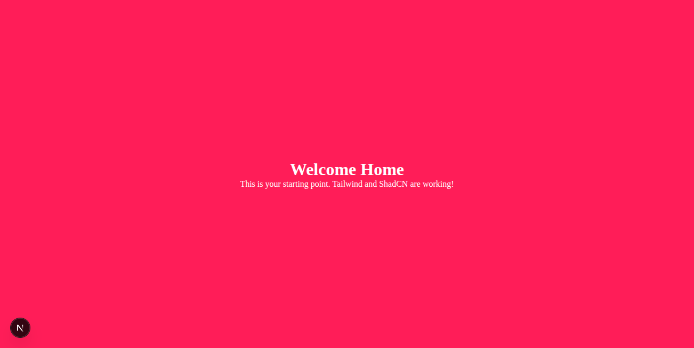

# Next.js Boilerplate

A modern Next.js boilerplate with App Router, TypeScript, Tailwind CSS, ShadCN/UI, and Material UI - designed for scalable development with a clean folder structure.

## Screenshot



## Tech Stack

- **[Next.js](https://nextjs.org/)** - React framework with App Router
- **[React](https://react.dev/)** - UI library
- **[TypeScript](https://www.typescriptlang.org/)** - Type safety
- **[Tailwind CSS](https://tailwindcss.com/)** - Utility-first CSS framework
- **[ShadCN/UI](https://ui.shadcn.com/)** - Beautiful component library
- **[Material UI](https://mui.com/)** - React component library
- **[ESLint](https://eslint.org/)** - Code linting

## Getting Started

### Prerequisites
- Node.js 18+ 
- npm, yarn, or pnpm

### Installation

1. **Clone the repository:**
   ```bash
   git clone https://github.com/zeeshanrafiqrana/nextjs_boilerplates.git
   cd nextjs-boilerplate
   ```

2. **Install dependencies:**
   ```bash
   npm install
   ```

3. **Run the development server:**
   ```bash
   npm run dev
   ```
   Open [http://localhost:3000](http://localhost:3000) in your browser.

4. **Build for production:**
   ```bash
   npm run build
   npm start
   ```

5. **Lint the code:**
   ```bash
   npm run lint
   # Or to fix issues automatically
   npm run lint:fix
   ```

## Project Structure

```
eslint.config.js
next-env.d.ts
next.config.ts
package.json
postcss.config.mjs
README.md
tsconfig.json
app/
  layout.tsx          # Root layout for all pages
  page.tsx            # Main entry page
  about/
    page.tsx          # Example sub-route
  api/
    index.ts          # Example API route
  components/
    Layout.tsx        # Layout components
    Page.tsx          # Page components
  hooks/
    index.ts          # Custom React hooks
  lib/
    utils.ts          # Utility functions and libraries
  styles/
    globals.css       # Global styles (imported in layout.tsx)
public/
  assets/
    shadcn.png        # Screenshot
  file.svg
  globe.svg
  next.svg
  vercel.svg
  window.svg
```

## Directory Guidelines

- **`app/`** - All main application code using [Next.js App Router](https://nextjs.org/docs/app)
- **`app/components/`** - Reusable React components
- **`app/hooks/`** - Custom React hooks
- **`app/lib/`** - Utility functions, configurations, and helper libraries
- **`app/styles/`** - Global styles and CSS modules
- **`public/`** - Static assets (images, icons, etc.)
- **`public/assets/`** - Project screenshots and media files

## Development Tips

- Use the `@/` alias for imports from the `app/` directory (configured in `tsconfig.json`)
- Edit `app/styles/globals.css` for global styles
- Place static files in the `public/` directory
- Components are organized by feature/functionality
- Follow the established naming conventions

## Features

- ✅ Next.js 14+ with App Router
- ✅ TypeScript for type safety
- ✅ Tailwind CSS for styling
- ✅ ShadCN/UI component system
- ✅ Material UI integration
- ✅ ESLint configuration
- ✅ Responsive design ready
- ✅ Modern folder structure
- ✅ Path aliases configured

## Learn More

- [Next.js Documentation](https://nextjs.org/docs) - Learn about Next.js features and API
- [Next.js App Router](https://nextjs.org/docs/app) - New App Router documentation
- [Tailwind CSS](https://tailwindcss.com/docs) - Utility-first CSS framework
- [ShadCN/UI](https://ui.shadcn.com/) - Component documentation
- [TypeScript](https://www.typescriptlang.org/docs/) - TypeScript handbook

## Deployment

The easiest way to deploy your Next.js app is to use the [Vercel Platform](https://vercel.com/new) from the creators of Next.js.

Check out the [Next.js deployment documentation](https://nextjs.org/docs/app/building-your-application/deploying) for more details.

## Contributing

1. Fork the repository
2. Create your feature branch (`git checkout -b feature/amazing-feature`)
3. Commit your changes (`git commit -m 'Add some amazing feature'`)
4. Push to the branch (`git push origin feature/amazing-feature`)
5. Open a Pull Request

## License

This project is open source and available under the [MIT License](LICENSE).