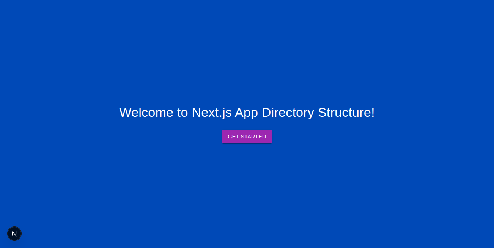

# Next.js Boilerplate

A modern Next.js boilerplate with Material-UI (MUI), Tailwind CSS, TypeScript, and a scalable folder structure designed for production-ready applications.

## Screenshot



## Tech Stack

- **[Next.js](https://nextjs.org/)** - React framework with App Router
- **[React](https://react.dev/)** - JavaScript library for building user interfaces
- **[TypeScript](https://www.typescriptlang.org/)** - Typed JavaScript for better development experience
- **[Material-UI (MUI)](https://mui.com/)** - React component library with Material Design
- **[Tailwind CSS](https://tailwindcss.com/)** - Utility-first CSS framework
- **[ESLint](https://eslint.org/)** - Code linting and formatting

## Getting Started

### Prerequisites
- Node.js 18+ 
- npm, yarn, or pnpm

### Installation & Development

1. **Install dependencies:**
   ```bash
   npm install
   ```

2. **Run the development server:**
   ```bash
   npm run dev
   ```
   Open [http://localhost:3000](http://localhost:3000) in your browser.

3. **Build for production:**
   ```bash
   npm run build
   npm start
   ```

4. **Lint the code:**
   ```bash
   npm run lint
   # Or to fix issues automatically
   npm run lint:fix
   ```

## Project Structure

```
eslint.config.js
next-env.d.ts
next.config.ts
package.json
postcss.config.mjs
tsconfig.json
app/
  layout.tsx          # Root layout for all pages
  page.tsx            # Main entry page
  about/
    page.tsx          # Example sub-route
  api/                # API route handlers
  components/         # Reusable React components
    Layout.tsx
    Page.tsx
  hooks/              # Custom React hooks
  lib/                # Utility functions and libraries
  styles/             # Global and modular CSS
    globals.css
public/               # Static assets
  assets/             # Project images and screenshots
    nextjs-boilerplate.png
  file.svg
  globe.svg
  next.svg
  vercel.svg
  window.svg
```

## Directory Overview

- **`app/`** - Main application folder using Next.js App Router
  - `layout.tsx` - Root layout component for all pages
  - `page.tsx` - Main entry page component
  - `about/` - Example sub-route demonstrating routing
  - `api/` - Server-side API route handlers
  - `components/` - Reusable React components
  - `hooks/` - Custom React hooks for shared logic
  - `lib/` - Utility functions, configurations, and helper libraries
  - `styles/` - Global CSS and component-specific styles

- **`public/`** - Static assets served directly by Next.js
  - `assets/` - Project screenshots and media files
  - Various SVG icons and images

- **Configuration Files**
  - `next.config.ts` - Next.js configuration
  - `tsconfig.json` - TypeScript configuration with path aliases
  - `postcss.config.mjs` - PostCSS configuration for Tailwind CSS
  - `eslint.config.js` - ESLint rules and configuration
  - `package.json` - Project metadata, dependencies, and scripts

## Development Guidelines

- **Import Aliases**: Use the `@/*` alias for imports from the `app` directory (configured in `tsconfig.json`)
- **Component Organization**: Keep components modular and reusable
- **Styling**: Combine MUI components with Tailwind utilities for flexible styling
- **Type Safety**: Leverage TypeScript for better code quality and developer experience
- **Code Quality**: Follow ESLint rules and use the linting scripts before commits

## Features

- ✅ Next.js 14+ with App Router
- ✅ TypeScript for type safety
- ✅ Material-UI component library integration
- ✅ Tailwind CSS utility classes
- ✅ ESLint configuration for code quality
- ✅ Scalable folder structure
- ✅ Path aliases configured (`@/*`)
- ✅ Production-ready build optimization
- ✅ API routes support

## Customization

- **Folder Structure**: Customize the directory organization as your project grows
- **Styling**: Mix and match MUI components with Tailwind utilities
- **Configuration**: Review and modify config files based on your requirements
- **Components**: Build your component library using the established patterns

## Learn More

- [Next.js Documentation](https://nextjs.org/docs) - Learn about Next.js features and API
- [Next.js App Router](https://nextjs.org/docs/app) - Modern routing in Next.js
- [Material-UI Documentation](https://mui.com/getting-started/overview/) - MUI component library
- [Tailwind CSS Documentation](https://tailwindcss.com/docs) - Utility-first CSS framework
- [TypeScript Handbook](https://www.typescriptlang.org/docs/) - TypeScript documentation

## Deployment

Deploy your Next.js app easily with:

- **[Vercel](https://vercel.com/)** - Recommended platform from Next.js creators
- **[Netlify](https://netlify.com/)** - Alternative deployment platform
- **[Railway](https://railway.app/)** - Full-stack deployment platform

Check out the [Next.js deployment documentation](https://nextjs.org/docs/app/building-your-application/deploying) for detailed deployment guides.

## Contributing

1. Fork the repository
2. Create your feature branch (`git checkout -b feature/amazing-feature`)
3. Commit your changes (`git commit -m 'Add some amazing feature'`)
4. Push to the branch (`git push origin feature/amazing-feature`)
5. Open a Pull Request

## License

This project is open source and available under the [MIT License](LICENSE).